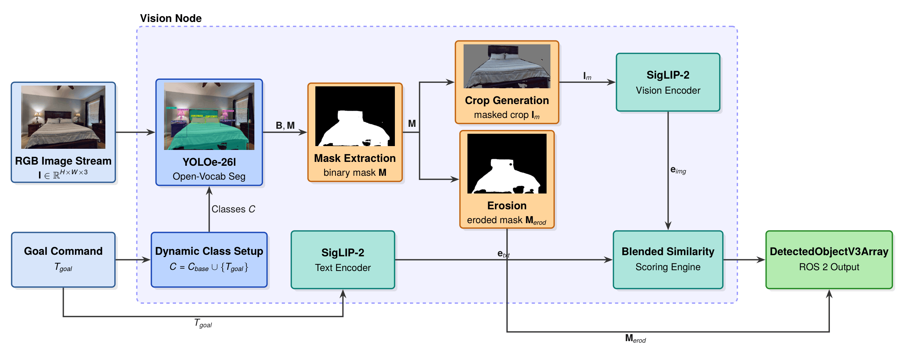
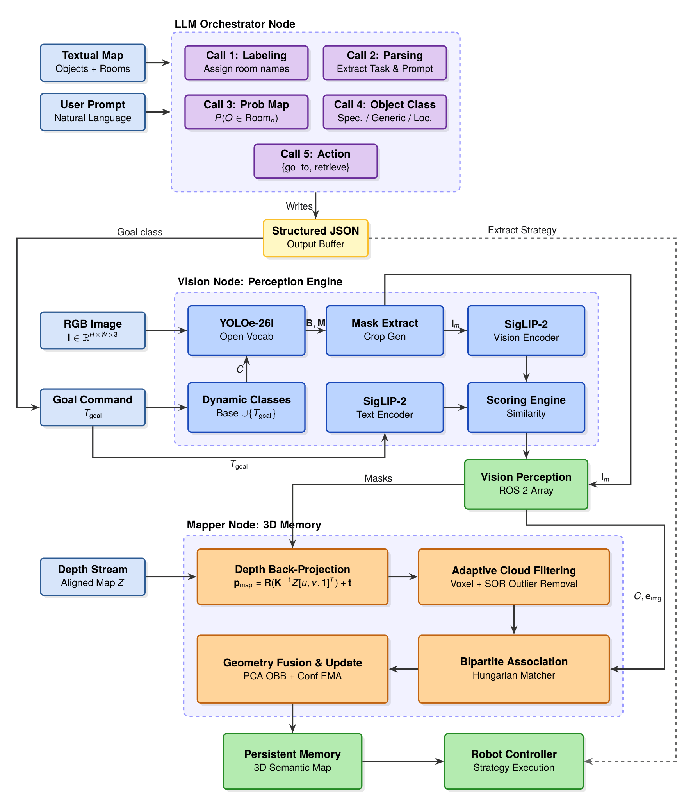

# YOLO11 Segmentation Bringup

Perception package of the semantic-navigation thesis stack.

This package is the **front end** of the system: it turns a natural-language instruction into
(a) an open-vocabulary detection vocabulary, (b) a SigLIP text embedding used as a *goal descriptor*,
and (c) per-frame instance masks + image embeddings. Everything downstream — the C++ semantic mapper
(`mapper_pkg`) and the behaviour tree (`bt_pkg`) — consumes what this package publishes.

It does **not** do 3D reconstruction and it does **not** drive the robot. It produces detections,
embeddings, room segmentation and the JSON files the rest of the stack reads.

---

## 1. Models

Three models run in this stack. They are separate, they run at different rates, and each one has a
different deployment format. Getting these three artifacts in place is most of the setup work.



*Inside `pc_vision_node_v3`. The goal command enters twice and drives two different models: as a class
label `T_goal` it extends the YOLOE vocabulary `C = C_base ∪ {T_goal}`, and as a text prompt it goes
through the SigLIP-2 text encoder. The binary mask forks — the dilated branch builds the masked crop
`I_m` that the SigLIP-2 vision encoder embeds, while the eroded mask `M_erod` is what gets published for
the mapper to back-project. The two encoders meet only at the scoring engine.*

### 1.1 YOLOE — open-vocabulary instance segmentation

| | |
|---|---|
| Artifact | `yoloe-26l-seg.pt` (Ultralytics checkpoint) |
| Loaded in | [pc_vision_v3.py:108](yolo11_seg_bringup/pc_vision_v3.py#L108) |
| Runs at | every RGB frame |
| Parameter | `model_path` |

Loaded as `YOLO(model_path, task='segment')`. It is an **open-vocabulary** model: the class list is
not baked into the weights, it is injected at startup with `model.set_classes(CLASS_NAMES)`.

The vocabulary is built from two sources:

1. A fixed base list hardcoded in the node
   ([pc_vision_v3.py:89-90](yolo11_seg_bringup/pc_vision_v3.py#L89-L90)):
   `microwave, keyboard, mouse, bottle, cup, tv, fridge, telephone, kettle, apple, laptop, drill`.
2. The `goal` string from `config/robot_command.json`, appended if it is not already present.

Consequence: **the vocabulary is fixed at node startup.** Changing the goal in `robot_command.json`
updates the SigLIP prompt live (see below), but it does *not* re-open the YOLOE vocabulary. If the LLM
picks a goal class that was not in the vocabulary when the node started, restart `pc_vision_node_v3`.

Inference uses `model.track(...)` rather than `predict`, with **BoT-SORT** (`tracker="botsort.yaml"`,
`persist=True`). The tracker IDs are published as `instance_id` and are what lets the C++ mapper take
its cheap "fast route" association (tracker_id → map_id) instead of running the Hungarian solver.

Masks are produced at model resolution (`retina_masks=False`). Each mask is thresholded at 0.5,
**eroded at low resolution** with a 5×5 ellipse (1 iteration) and only then resized to full frame with
nearest-neighbour interpolation ([pc_vision_v3.py:396-412](yolo11_seg_bringup/pc_vision_v3.py#L396-L412)).
Eroding before upscaling is deliberate: it is much cheaper, and it pulls the mask boundary inward so
that the depth pixels the mapper back-projects belong to the object rather than to the background
behind its silhouette.

Defaults: `imgsz=640`, `conf=0.45`, `iou=0.35`.

### 1.2 SigLIP 2 — image/text embeddings and goal scoring

SigLIP 2 is used in **two different deployments** in this package, because the two consumers have very
different latency budgets.

#### (a) Split TensorRT + PyTorch — `utils/siglip2_processor_2.py`

Used by `pc_vision_node_v3`. This is the deployment that runs on the robot (Jetson).

| Tower | Format | Artifact | Parameter |
|---|---|---|---|
| Vision | TensorRT engine | `siglip_vision_pooled_384_fp16.engine` | `CLIP_model_path` |
| Text | HuggingFace `AutoModel` | `local_siglip_model/` (local dir) | `CLIP_model_name` |

The split is the point. The vision tower runs on **every detection of every sampled frame**, so it is
exported to a FP16 TensorRT engine with a dynamic batch dimension (max 32) at fixed 384×384. The text
tower runs **only when the prompt changes** (a few times per mission), so it stays in PyTorch, where
the tokenizer and processor are available for free.

The engine contract the code depends on:

- input tensor named `pixel_values`, shape `(B, 3, 384, 384)`, dynamic on `B` up to 32
- output tensor named `image_embedding`, already pooled and ready for the dot product

Preprocessing is deliberately hybrid ([siglip2_processor_2.py:121-147](yolo11_seg_bringup/utils/siglip2_processor_2.py#L121-L147)):
resize to 384×384 and BGR→RGB happen on CPU with OpenCV while the data is still `uint8` (small, so the
host→device copy is cheap), then normalization (`/255`, mean 0.5, std 0.5) and the NHWC→NCHW transpose
happen **on the GPU** with torch. The resulting CUDA tensor is handed to TensorRT with a
device-to-device copy (`cuda.memcpy_dtod_async`) — the pixel data never round-trips through host memory.

`logit_scale` and `logit_bias` are read once from the PyTorch model and cached, because the TensorRT
engine only carries the vision tower and cannot supply them.

#### (b) Plain HuggingFace — `utils/siglip2_processor.py`

Used by `scene_embedding_node`. Loads a full SigLIP 2 model through `transformers` and calls
`get_image_features` / `get_text_features` directly. Slower, but this node samples one frame in 15 and
embeds the whole image once, so throughput is irrelevant.

The node's `CLIP_model_name` default is `google/siglip2-large-patch16-384`; the class's own default is
a local base-256 directory. This module also carries dense patch-level helpers
(`get_dense_feature_map`, `generate_findanything_heatmap`) that replicate the FindAnything/OKVIS2-X
heatmap; **no ROS node currently calls them** — they are there for offline analysis.

#### Prompt ensembling

Both processors encode text the same way. A single label is expanded into 7 templates
([siglip2_processor_2.py:87-98](yolo11_seg_bringup/utils/siglip2_processor_2.py#L87-L98)):

```
"a photo of a {label}."          "a bad photo of a {label}."
"a photo of the large {label}."  "a photo of the small {label}."
"a cropped photo of a {label}."  "a close-up photo of a {label}."
"a clear photo of a {label}."
```

Each is encoded, L2-normalized, the 7 vectors are averaged, and the mean is re-normalized. The result
is one vector that is more robust to scale and crop quality than any single template.

#### Masked vs unmasked crops

For each detection the node builds **two** crops from the same bounding box
([siglip2_processor_2.py:199-220](yolo11_seg_bringup/utils/siglip2_processor_2.py#L199-L220)):

- **unmasked** — the raw bbox crop, background included
- **masked** — the mask is dilated (5×5, 1 iteration, undoing part of the earlier erosion so the object
  outline is not clipped) and the object is composited onto a **neutral grey (122,122,122)** background.
  Grey rather than black because after SigLIP's mean/std=0.5 normalization, 122 maps to ≈0 — a
  near-zero-signal background instead of a strong dark edge the vision tower would attend to.

Whether both are computed is controlled by `compute_unmasked_embeddings`, **default `False`**. With
the default only the masked crop is encoded, which halves the batch. Consequently the blended score
path is not taken at runtime by default; see the scoring section.

#### Scoring math

SigLIP is a sigmoid model, not a softmax model, so the score is per-pair and absolute (no competition
between candidates):

```
logit = dot(image_embedding, text_embedding) * logit_scale + logit_bias
score = sigmoid(clamp(logit, -60, +60)) * 100
```

When both crops exist, the two scores are blended:

```
score = 0.85 * masked_score + 0.15 * unmasked_score
```

(`masked_score_weight` / `unmasked_score_weight`, normalized to sum to 1). With
`compute_unmasked_embeddings=False` the node falls back to `compute_match_score` on the masked
embedding alone ([pc_vision_v3.py:757-767](yolo11_seg_bringup/pc_vision_v3.py#L757-L767)),
so the weights have no effect unless you turn unmasked embeddings on.

`scene_embedding_node` publishes the **raw logit, negated** (`-compute_match_logit`) instead of the
0-100 score, because after the sigmoid all realistic scene-level matches saturate near 0 and small
changes become invisible.

### 1.3 Llama 3.1 8B Instruct — instruction → structured command

| | |
|---|---|
| Artifact | `meta-llama/Llama-3.1-8B-Instruct` (HF cache) |
| Script | [scripts/reduced_llm_transformers.py](scripts/reduced_llm_transformers.py) |
| Runs | offline, interactively, once per mission — **not** a ROS node |

Loaded as a `transformers` `text-generation` pipeline in FP16 with `device_map="auto"`.
`OFFLINE_MODE = True` at the top of the file, so it will only load from the local HF cache.

It runs **five staged calls**, each with its own prompt template in `scripts/prompts/`, its own
Pydantic output schema, its own temperature, and up to 3 retries with `extract_json_from_response`
(a 3-strategy parser: whole-response JSON → nested-brace regex → markdown code fence):

| # | Stage | Template | Temp | Output |
|---|---|---|---|---|
| 0 | Label each cluster with a room name | `label_clusters.txt` | 0.4 | `{cluster_id: label}`, duplicates disambiguated with `#1`, `#2` |
| 1 | Extract goal class + visual prompt | `extract_goal_and_clip.txt` | 0.2 | `goal`, `clip_prompt` |
| 2 | Pick the cluster and an anchor object | `determine_cluster.txt` | 0.4 | `cluster_id`, `reasoning`, `anchor_object_id`, `location_confidence` |
| 3 | Extract the action | `extract_action.txt` | 0.1 | `go_to_object` \| `bring_back_object` |
| 4 | Classify the navigation logic | `decide_logic.txt` | 0.2 | `GENERIC_OBJECT` \| `GENERIC_OBJECT_SPECIFIC_LOCATION` \| `SPECIFIC_OBJECT_WITH_FEATURES` |

Stage 1 is prompted to split the instruction cleanly: `goal` must be the bare object **class** (which
becomes the YOLOE vocabulary entry), while `clip_prompt` carries only the **visual features** (which
become the SigLIP text embedding). "Go to the blue coffee machine in the kitchen" →
`goal="coffee machine"`, `clip_prompt="blue coffee machine"`, and the kitchen is handled separately by
stage 2 as a cluster choice. This separation is what lets a coarse detector and a fine-grained
embedding model each do the part they are good at.

Stage 2's `anchor_object_id` is validated against the objects actually in the chosen cluster and
cleared if the LLM hallucinated an ID ([reduced_llm_transformers.py:496-501](scripts/reduced_llm_transformers.py#L496-L501)).

Stage 4's output selects the goal-selection strategy in `bt_pkg`'s `SelectGoal` node: nearest instance,
nearest instance inside the chosen cluster, or highest SigLIP similarity above a threshold (8.0).

`extract_related_object.txt` is present in `prompts/` but is not called by the current script.

---

## 2. Pipeline



*The full stack. The LLM orchestrator turns the textual map and the user prompt into a structured JSON
command; the vision node consumes it as a class list and a text embedding; the mapper node lifts the
masks into a persistent 3D semantic map; the robot controller executes the strategy the same JSON
carries. The dashed return path is what makes the loop closed — the strategy chosen by the LLM decides
how the map is queried.*

The diagram above is the algorithmic view. Below is the concrete ROS wiring, including the JSON files
that carry state between runs and the room-segmentation stage the diagram leaves out:

```
                      ┌──────────────────────────────────────────┐
   human instruction  │ scripts/reduced_llm_transformers.py      │
   ─────────────────▶ │   Llama 3.1 8B, 5 staged calls           │
                      │   reads map_v6.json + clustered_map_v6   │
                      └────────────────────┬─────────────────────┘
                                           │ writes
                                           ▼
                              ┌─────────────────────────┐
                              │ config/robot_command.json│◀────────────┐
                              │ goal / clip_prompts /    │             │
                              │ cluster / anchor /       │             │
                              │ action / logic           │             │
                              └──┬──────────────────┬────┘             │
              goal → vocabulary  │                  │ goal/cluster/    │
              clip_prompts →     │                  │ logic/anchor     │
              text embedding     ▼                  ▼                  │
   RGB ──────────────▶ ┌──────────────────┐   ┌──────────────┐         │
                       │ pc_vision_node_v3│   │   bt_pkg     │         │
                       │  YOLOE + SigLIP  │   │ behaviour    │         │
                       └───┬──────────┬───┘   │ tree + Nav2  │         │
        /vision/detections │          │       └──────┬───────┘         │
        (masks, embeddings,│          │ /vision/     │ services        │
         tracker IDs)      │          │ text_embedding│                │
                           ▼          ▼              │                 │
   depth + camera_info ─▶ ┌──────────────────────┐   │                 │
                          │  mapper_pkg (C++)    │   │                 │
                          │  depth back-proj,    │   │                 │
                          │  Hungarian assoc,    │   │                 │
                          │  OBB fusion,         │   │                 │
                          │  goal similarity     │   │                 │
                          └──────────┬───────────┘   │                 │
                       /vision/semantic_map_v5       │                 │
                                     │               │                 │
                     ┌───────────────┴───────────┐   │                 │
                     ▼                           ▼   │                 │
      ┌──────────────────────────┐  ┌──────────────────────────┐       │
      │ cpp_mapper_json_exporter │  │  cluster_assignment_node │       │
      │  → config/map_v6.json ───┼──┼──┐  watershed rooms,     │       │
      └──────────────────────────┘  │  │  room assignment,     │       │
                                    │  │  waypoint/approach    │       │
      /jackal/map ─────────────────▶│  │  services             │       │
      /jackal/global_costmap ──────▶│  └───────────────────────┘       │
                                    │   /vision/clustered_map_v6 ──────┘
                                    └── → config/clustered_map_v6.json ┘
```

Step by step:

1. **Instruction parsing (offline).** `reduced_llm_transformers.py` reads the two map JSONs from a
   previous run, labels the clusters as rooms, parses the instruction, and writes
   `config/robot_command.json`.

2. **Vision.** `pc_vision_node_v3` reads `robot_command.json` at startup to extend the YOLOE
   vocabulary with the goal class, and re-reads it every 5 s to pick up prompt changes. Per frame it
   runs YOLOE+BoT-SORT, erodes and upscales the masks, and every 10th frame prepares the SigLIP crops.
   It publishes `/vision/detections` (class, tracker ID, confidence, `mono8` mask, masked/unmasked
   embeddings, the current text embedding, and the similarity score) and periodically
   `/vision/text_embedding` (the embedding vector with `logit_scale` and `logit_bias` appended).

3. **Semantic mapping (external, `mapper_pkg`).** Synchronizes `/vision/detections` with aligned depth
   and camera intrinsics, back-projects masked depth pixels, associates detections to persistent
   objects (tracker binding first, Hungarian on distance + OBB overlap + embedding cosine + class
   penalty otherwise), fuses geometry into an OBB, and publishes `/vision/semantic_map_v5`. It uses
   `/vision/text_embedding` to recompute each object's goal similarity on every publish — so
   similarity is a *live* property of the map, not a snapshot from detection time.

4. **Export.** `cpp_mapper_json_exporter_node` snapshots `/vision/semantic_map_v5` to
   `config/map_v6.json` every 3 s. This is the file the LLM reads on the next run.

5. **Room assignment.** `cluster_assignment_node` segments the occupancy grid into rooms with a
   distance-transform + watershed, then assigns each **new** semantic object the room the *robot* was
   standing in when that object was first seen (TF `map→base_link` looked up at the object's own
   timestamp). Already-known objects keep their room but get their pose and similarity refreshed. It
   writes `config/clustered_map_v6.json`, publishes `/vision/clustered_map_v6`, and serves the two
   services the behaviour tree calls.

6. **Execution (external, `bt_pkg`).** Reads `robot_command.json`, subscribes to
   `/vision/clustered_map_v6`, picks a target according to the `logic` field, and drives Nav2 —
   falling back to exploring the chosen room's waypoint when the goal has not been seen yet.

### Two design points worth noting

**The loop is closed through files, and it is a two-pass loop.** The LLM needs `map_v6.json` and
`clustered_map_v6.json` to reason about rooms and anchors, but those files are produced by a mapping
run. A cold system therefore needs one exploration pass to populate the map before instruction parsing
becomes meaningful.

**SigLIP never blocks YOLO.** `process_frame` pushes a payload onto a `queue.Queue(maxsize=2)` and
returns; a daemon worker thread does the SigLIP batch and the publishing
([pc_vision_v3.py:317-374](yolo11_seg_bringup/pc_vision_v3.py#L317-L374)). When the queue is full the
frame is dropped with a throttled warning rather than allowed to build latency. Combined with
`frame_skip = 10` (hardcoded, not a parameter), this keeps the detection stream at camera rate while
the embedding stream runs at roughly 1/10 of it.

---

## 3. What you need to run it

### 3.1 Model artifacts

None of these are in the repository. Paths below are the node defaults; override with parameters.

| Artifact | Default path | How to obtain |
|---|---|---|
| YOLOE segmentation checkpoint | `/home/workspace/yoloe-26l-seg.pt` | Ultralytics YOLOE release |
| SigLIP 2 vision TensorRT engine | `/home/workspace/siglip_vision_pooled_384_fp16.engine` | Build on the target device (below) |
| SigLIP 2 HF model dir (text tower + processor) | `/home/workspace/local_siglip_model` | `snapshot_download` of a SigLIP 2 checkpoint |
| Llama 3.1 8B Instruct | HF cache | Gated — accept the licence, then `huggingface-cli download`. First run needs `OFFLINE_MODE = False` |

The TensorRT engine must be built **on the machine that will run it** — engines are not portable
across GPU/TensorRT versions. Export the SigLIP 2 vision tower to ONNX with the pooled output, naming
the input `pixel_values` and the output `image_embedding`, then:

```bash
trtexec --onnx=siglip_vision_pooled_384.onnx \
        --saveEngine=siglip_vision_pooled_384_fp16.engine \
        --fp16 \
        --minShapes=pixel_values:1x3x384x384 \
        --optShapes=pixel_values:8x3x384x384 \
        --maxShapes=pixel_values:32x3x384x384
```

`maxShapes` must match `max_batch_size=32` in
[siglip2_processor_2.py:17](yolo11_seg_bringup/utils/siglip2_processor_2.py#L17); the buffers are
allocated for the max batch once at startup and never reallocated.

### 3.2 Package dependencies

**`yolo11_seg_interfaces` is required and lives outside this repository.** Nothing in this package
builds or runs without it. It must provide:

- messages: `DetectedObjectV3`, `DetectedObjectV3Array`, `SemanticObject`, `SemanticObjectArray`,
  `ClusteredMapObject`, `ClusteredMapObjectArray`, `ClusterBoundingBox2D`, `Similarity`,
  `SimilarityCentroidArray`
- services: `GetRoomWaypoint`, `GetApproachPose`

Sibling packages of the thesis stack: `mapper_pkg` (C++ semantic mapper), `bt_pkg` (behaviour tree).

Python packages, in the environment ROS runs from:

```bash
pip install ultralytics torch torchvision transformers opencv-python pillow numpy scikit-learn pydantic
```

`tensorrt` and `pycuda` are imported unconditionally by `utils/siglip2_processor_2.py`, so
`pc_vision_node_v3` **cannot start without a working TensorRT + PyCUDA install**. On Jetson these come
from JetPack, not from pip. `scene_embedding_node` does not need them.

### 3.3 Robot-side prerequisites

These come from the platform, not from this package. Without them the pipeline runs but produces
nothing useful:

- an RGB-D driver publishing colour, **depth aligned to colour**, and `CameraInfo`
- TF with a valid `map → base_link` chain (used for room assignment and by the BT)
- SLAM or localization publishing `/jackal/map` (`nav_msgs/OccupancyGrid`)
- Nav2, providing `/jackal/global_costmap/costmap` and the `navigate_to_pose` action

Note the default topic names are Jackal-specific (`/jackal/sensors/camera_0/...`) while `mapper_pkg`
defaults to RealSense names (`/camera/camera/...`). **Check that both ends point at the same camera**
before debugging anything else.

### 3.4 Build

```bash
cd /home/workspace/ros2_ws
colcon build --packages-select yolo11_seg_interfaces yolo11_seg_bringup mapper_pkg bt_pkg
source install/setup.bash
```

There is no `launch/` directory in this package; `setup.py` still globs `launch/*.launch.py`, which is
harmless (the glob is empty). Everything below is run node by node.

### 3.5 Running — minimal object-search mission

Source `install/setup.bash` in every terminal.

**Terminal 1 — vision.** Start this first: it publishes the detections and the text embedding
everything else depends on.

```bash
ros2 run yolo11_seg_bringup pc_vision_node_v3 --ros-args \
  -p model_path:=/home/workspace/yoloe-26l-seg.pt \
  -p CLIP_model_path:=/home/workspace/siglip_vision_pooled_384_fp16.engine \
  -p CLIP_model_name:=/home/workspace/local_siglip_model \
  -p image_topic:=/jackal/sensors/camera_0/color/image
```

**Terminal 2 — semantic mapper** (from `mapper_pkg`; remap depth/camera_info to your camera):

```bash
ros2 run mapper_pkg mapper_node
```

**Terminal 3 — JSON export** (feeds the LLM on the next mission):

```bash
ros2 run yolo11_seg_bringup cpp_mapper_json_exporter_node
```

**Terminal 4 — room segmentation, clustered map, and BT services:**

```bash
ros2 run yolo11_seg_bringup cluster_assignment_node
```

**Terminal 5 — instruction parsing.** Interactive; type an instruction at the prompt. Requires
`map_v6.json` and `clustered_map_v6.json` to already exist:

```bash
cd /home/workspace/ros2_ws/src/yolo11_seg_bringup
python3 scripts/reduced_llm_transformers.py
```

Then **restart `pc_vision_node_v3`** so the new goal class enters the YOLOE vocabulary (the SigLIP
prompt would have refreshed on its own, but the detector vocabulary would not).

**Terminal 6 — execution** (from `bt_pkg`):

```bash
ros2 run bt_pkg bt_manager
```

Optional — RViz object markers:

```bash
ros2 run yolo11_seg_bringup map_points_node
```

### 3.6 Bring-up order that actually works from cold

1. Camera, TF, SLAM, Nav2.
2. `pc_vision_node_v3` + `mapper_node` + `cpp_mapper_json_exporter_node` + `cluster_assignment_node`.
3. Drive the robot around (teleop or the BT's exploration branch) until `config/map_v6.json` and
   `config/clustered_map_v6.json` have content.
4. Run `reduced_llm_transformers.py` and give it the instruction.
5. Restart `pc_vision_node_v3`.
6. Run the behaviour tree.

---

## 4. ROS nodes

### `pc_vision_node_v3` — [pc_vision_v3.py](yolo11_seg_bringup/pc_vision_v3.py)

YOLOE segmentation + BoT-SORT tracking + SigLIP embedding and goal scoring. Class name is `VisionNode`.
See the [block diagram](#1-models) at the top of §1 for how the pieces connect.

**Subscribes**

| Topic | Type | Notes |
|---|---|---|
| `/jackal/sensors/camera_0/color/image` | `sensor_msgs/Image` | `image_topic`; BEST_EFFORT, depth 5 |
| `/jackal/sensors/camera_0/aligned_depth_to_color/image` | `sensor_msgs/Image` | `depth_topic`; **cached only, used exclusively for paper-figure export** — the node does no 3D reasoning |

**Publishes**

| Topic | Type | Notes |
|---|---|---|
| `/vision/detections` | `DetectedObjectV3Array` | class, tracker ID, confidence, `mono8` mask, masked/unmasked embeddings, text embedding, similarity |
| `/vision/text_embedding` | `Float32MultiArray` | embedding, then `logit_scale`, then `logit_bias` appended as the last two elements |
| `/vision/annotated_image` | `sensor_msgs/Image` | when `enable_visualization` |

**Parameters**

| Parameter | Default |
|---|---|
| `image_topic` | `/jackal/sensors/camera_0/color/image` |
| `depth_topic` | `/jackal/sensors/camera_0/aligned_depth_to_color/image` |
| `enable_visualization` | `True` |
| `model_path` | `/home/workspace/yoloe-26l-seg.pt` |
| `imgsz` / `conf` / `iou` | `640` / `0.45` / `0.35` |
| `CLIP_model_name` | `/home/workspace/local_siglip_model` (HF dir, text tower) |
| `CLIP_model_path` | `/home/workspace/siglip_vision_pooled_384_fp16.engine` (TRT, vision tower) |
| `robot_command_file` | `…/config/robot_command.json` |
| `prompt_check_interval` | `5.0` s |
| `masked_score_weight` / `unmasked_score_weight` | `0.85` / `0.15` |
| `compute_unmasked_embeddings` | `False` |
| `enable_paper_capture` | `False` |
| `paper_capture_class` | `bed` |
| `paper_images_output_dir` | `…/yolo11_seg_bringup/images` |
| `annotated_font_size` / `annotated_line_width` | `1.0` / `2` |

`enable_paper_capture` dumps, every 5 s, the intermediate stages for the highest-confidence detection
of `paper_capture_class`: raw frame, annotated frame, binary mask, eroded mask, masked crop, unmasked
crop, and both depth renderings. This is what produced the stage-by-stage PNGs in [images/](images/)
(everything except the two hand-drawn block diagrams); it is a figure
generator for the thesis, not a runtime feature. It also forces crop preparation outside the normal
1-in-10 SigLIP cadence.

Timing statistics (YOLO inference, detection processing, SigLIP encoding, GPU→CPU transfer,
publishing, total) are printed every 30 frames.

### `scene_embedding_node` — [scene_embedding_node.py](yolo11_seg_bringup/scene_embedding_node.py)

Scene-level branch, independent of the object pipeline. Embeds one whole frame in 15 and scores it
against `config/scene_prompt.json`.

- **Subscribes:** `/jackal/sensors/camera_0/color/image`
- **Publishes:** `/vision/scene_embedding` (`Float64MultiArray`), `/vision/scene_similarity_raw`
  (`Similarity`, with the source frame's `header.stamp`)
- **Parameters:** `image_topic`, `scene_prompt_file`, `CLIP_model_name`
  (`google/siglip2-large-patch16-384`), `sample_every_n_frames` (15), `prompt_check_interval` (2.0),
  `scene_embedding_topic`, `scene_similarity_topic`

Prompt file accepts `scene_prompt`, `scene_prompts`, `prompt`, or `clip_prompts`, as a string or a list
of strings. Publishes the **negated raw logit**, not a 0-100 score — see §1.2.

### `cpp_mapper_json_exporter_node` — [cpp_mapper_json_exporter_node.py](yolo11_seg_bringup/cpp_mapper_json_exporter_node.py)

Snapshots the semantic map topic to JSON on a timer.

- **Subscribes:** `/vision/semantic_map_v5` (`SemanticObjectArray`) — `input_topic`
- **Writes:** `{output_dir}/{output_map_file}` = `…/config/map_v6.json`
- **Parameters:** `input_topic`, `output_dir`, `output_map_file`, `export_interval` (3.0 s, forced to
  3.0 if ≤ 0)

Each export is a full rewrite of the latest message, keyed by `object_id`.

### `cluster_assignment_node` — [cluster_assignment_node.py](yolo11_seg_bringup/cluster_assignment_node.py)

Room segmentation, per-object room assignment, clustered-map publishing, and the two services the
behaviour tree calls. Class name is `ClusteredMapPreprocPublisherNode`.

**How rooms are found** ([cluster_assignment_node.py:290-316](yolo11_seg_bringup/cluster_assignment_node.py#L290-L316)):
free cells of the occupancy grid → `distanceTransform` → threshold at
`dist_thresh_multiplier × max` to get room seeds → `connectedComponents` → `watershed` to grow the
seeds out to the walls. Marker `-1` is a watershed boundary, marker `1` is background; every other
marker is a room.

**How objects get a room.** Not by clustering object positions — by **where the robot was**. For each
newly seen object, TF `map → base_link` is looked up *at that object's own timestamp* and the room
label under the robot becomes the object's room. Objects already in the local map keep their original
assignment but have `similarity` and `pose_map` refreshed from the mapper.

**What `cluster_centroid` actually is.** Not a geometric centroid. It is one *randomly sampled,
collision-free point* inside the room: the room mask eroded by the robot radius (0.35 m), then a
uniform random pick among the surviving pixels ([cluster_assignment_node.py:243-288](yolo11_seg_bringup/cluster_assignment_node.py#L243-L288)).
It is a navigable "go look in this room" target, which is why the BT can drive straight to it. It is
resampled on every processing cycle.

**Subscribes**

| Topic | Type |
|---|---|
| `/jackal/map` | `nav_msgs/OccupancyGrid` |
| `/jackal/global_costmap/costmap` | `nav_msgs/OccupancyGrid` |
| `/vision/semantic_map_v5` | `SemanticObjectArray` (`input_topic`) |

**Publishes**

| Topic | Type | Notes |
|---|---|---|
| `/vision/clustered_map_v6` | `ClusteredMapObjectArray` | re-read from the JSON file each cycle |
| `/vision/clustered_map_grid` | `nav_msgs/OccupancyGrid` | rooms spread over cell values 1-98 so RViz's costmap colour scheme gives each room a distinct colour; walls 100, background −1. TRANSIENT_LOCAL so late RViz subscribers still get it |
| `/vision/clustered_map_vis` | `sensor_msgs/Image` | per-room random colours, stable per marker |

**Services**

| Service | Type | Behaviour |
|---|---|---|
| `/vision/get_room_waypoint` | `GetRoomWaypoint` | one safe random point inside the requested room |
| `/vision/get_approach_pose` | `GetApproachPose` | samples rings of increasing radius around the goal; angles are ordered so the goal→robot direction is tried first, keeps the first point that is both inside the goal's room and free in the costmap, and yaws it to face the goal |

**Parameters:** `output_clustered_map_file`, `output_topic`, `input_topic`, `visualization_topic`,
`frame_id` (`map`), `publish_rate_hz` (0.5), `dist_thresh_multiplier` (0.1), `min_radius` (0.1),
`max_radius` (2.5), `radius_step` (0.05), `angle_step_deg` (5.0), `free_threshold` (0),
`enable_object_removal` (True), `wall_search_radius_px` (10).

Room segmentation runs as soon as `/jackal/map` arrives; object clustering is skipped until the mapper
publishes. The publish timer reads the JSON file independently, so `/vision/clustered_map_v6` keeps
being served from the last written file even if the mapper stops.

### `map_points_node` — [map_points_node.py](yolo11_seg_bringup/map_points_node.py)

RViz visualization of `map_v6.json`: a point, a text label, and a 3D OBB wireframe per object, coloured
by a hash of the class name.

- **Publishes:** `/vision/map_objects_markers`, `/vision/map_objects_bbox_markers` (`MarkerArray`)
- **Parameters:** `map_file`, `map_frame` (`map`), `marker_topic`, `bbox_marker_topic`,
  `publish_rate_hz` (1.0), `point_scale` (0.06), `label_height_offset` (0.2), `bbox_alpha` (0.35),
  `bbox_min_edge_m` (0.02), `bbox_line_width` (0.03)

### `semantic_navigator` — [semantic_navigator.py](yolo11_seg_bringup/semantic_navigator.py)

Standalone greedy navigator — an **alternative** to `bt_pkg`, not part of the main pipeline. Subscribes
to `/similarity_centroids_data` (`SimilarityCentroidArray`), scores clusters with
`cost = distance × 1.0 + similarity × 5.0`, and sends the lowest-cost cluster to Nav2's
`navigate_to_pose`. It refuses new goals while one is in flight. See the caveat in §7.

---

## 5. Non-ROS scripts

### `scripts/reduced_llm_transformers.py`

Interactive instruction parser (see §1.3). Reads `config/map_v6.json` and
`config/clustered_map_v6.json`, loops on `input()`, and rewrites `config/robot_command.json` after each
instruction. All paths are absolute constants at the top of the file.

```bash
cd /home/workspace/ros2_ws/src/yolo11_seg_bringup
python3 scripts/reduced_llm_transformers.py
```

### `scripts/prompts/`

One template per LLM stage: `label_clusters.txt`, `extract_goal_and_clip.txt`, `determine_cluster.txt`,
`extract_action.txt`, `decide_logic.txt`, plus the currently unused `extract_related_object.txt`.
Loaded with `str.format_map` over a dict that leaves unknown keys intact, so a template can contain
literal braces as long as they are doubled.

---

## 6. Config files

### `config/robot_command.json` — LLM → everything else

| Field | Consumed by |
|---|---|
| `goal` | `pc_vision_node_v3` (YOLOE vocabulary, at startup only); `bt_pkg` `ReadJson` |
| `clip_prompts` | `pc_vision_node_v3` (SigLIP text embedding, live) — **a single string, not a list** |
| `anchor_object_id`, `anchor_object_class` | `bt_pkg` `SelectGoal` |
| `cluster_info.cluster_id` | `bt_pkg` — which room to search |
| `action` | `bt_pkg` — `go_to_object` or `bring_back_object` |
| `logic` | `bt_pkg` `SelectGoal` — selects the goal-picking strategy |
| `timestamp`, `prompt`, `cluster_info.reasoning`, `location_confidence` | bookkeeping / debugging |

### `config/map_v6.json` — mapper → LLM, RViz

Dictionary keyed by object ID (`map_obj_000001`, …). Per object: `name`, `frame`, `timestamp`,
`pose_map`, `bbox_type`, `box_size`, `bbox_orientation`, `bbox_corners` (8 points), `occurrences`,
`similarity`, `image_embedding_masked`, `image_embedding_unmasked`, `confidence`,
`embedding_confidence`.

### `config/clustered_map_v6.json` — room assignment → LLM, BT

List of objects. Per entry: `id`, `cluster` (room ID, `-1` when the TF lookup failed), `class`,
`similarity`, `coords` (x, y), `cluster_centroid` (the safe random room point, §4).

### `config/scene_prompt.json`

Single key `scene_prompt` with a free-form scene description for `scene_embedding_node`.

---

## 7. Known caveats

**Goal vocabulary needs a vision restart.** `CLASS_NAMES` is frozen when `pc_vision_node_v3` starts.
The SigLIP prompt refreshes live; the YOLOE vocabulary does not.

**The LLM does not reconcile goal names against the map vocabulary.** If the instruction says
"television" and the map contains `tv`, the goal stays `television`, YOLOE gets an unmatched class, and
`SelectGoal` finds no candidates. This is the main open item.

**Unmasked embeddings are off by default**, so `masked_score_weight` / `unmasked_score_weight` have no
effect unless `compute_unmasked_embeddings:=true`. The blended-score path is dead code at default
settings.

**`ClusterBoundingBox2D` is populated with zeros** in `_to_msg` and never attached to the outgoing
message ([cluster_assignment_node.py:472-476](yolo11_seg_bringup/cluster_assignment_node.py#L472-L476)).
Cluster 2D bounds are not currently exported.

**Hardcoded absolute paths.** Defaults assume the workspace is at `/home/workspace/ros2_ws`. The BT XML
in `bt_pkg` and the constants in `reduced_llm_transformers.py` hardcode the same prefix; changing the
workspace location means changing all three.

**No launch files.** Every node is started by hand.

---

## 8. Package layout

```text
yolo11_seg_bringup/
├── yolo11_seg_bringup/
│   ├── pc_vision_v3.py                  # YOLOE + SigLIP (TensorRT) detection node
│   ├── scene_embedding_node.py          # scene-level SigLIP branch
│   ├── cpp_mapper_json_exporter_node.py # semantic map topic -> map_v6.json
│   ├── cluster_assignment_node.py       # watershed rooms, clustered map, BT services
│   ├── map_points_node.py               # RViz markers from map_v6.json
│   ├── semantic_navigator.py            # standalone greedy Nav2 client (alternative to bt_pkg)
│   └── utils/
│       ├── siglip2_processor_2.py       # TensorRT vision tower + PyTorch text tower
│       └── siglip2_processor.py         # pure HuggingFace SigLIP 2 (+ dense heatmap helpers)
├── scripts/
│   ├── reduced_llm_transformers.py      # Llama 3.1 instruction parser
│   └── prompts/                         # one template per LLM stage
├── config/
│   ├── map_v6.json
│   ├── clustered_map_v6.json
│   ├── robot_command.json
│   └── scene_prompt.json
├── images/                              # block diagrams + stage figures from enable_paper_capture
├── setup.py
└── package.xml
```

## License

Apache-2.0
